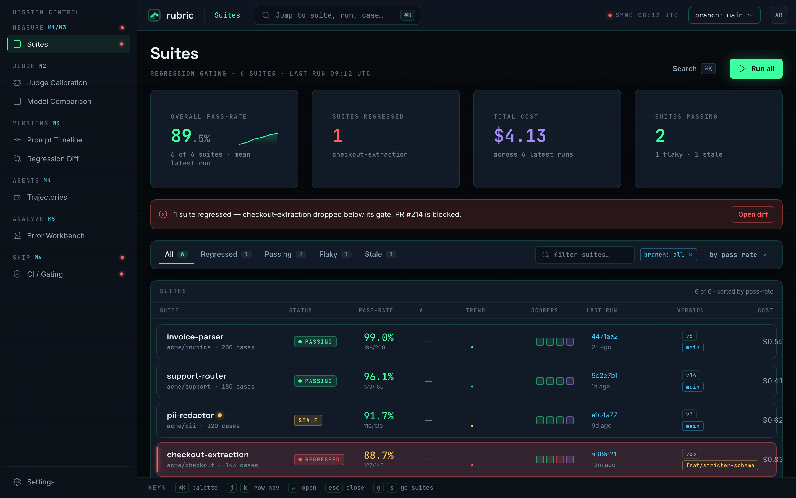
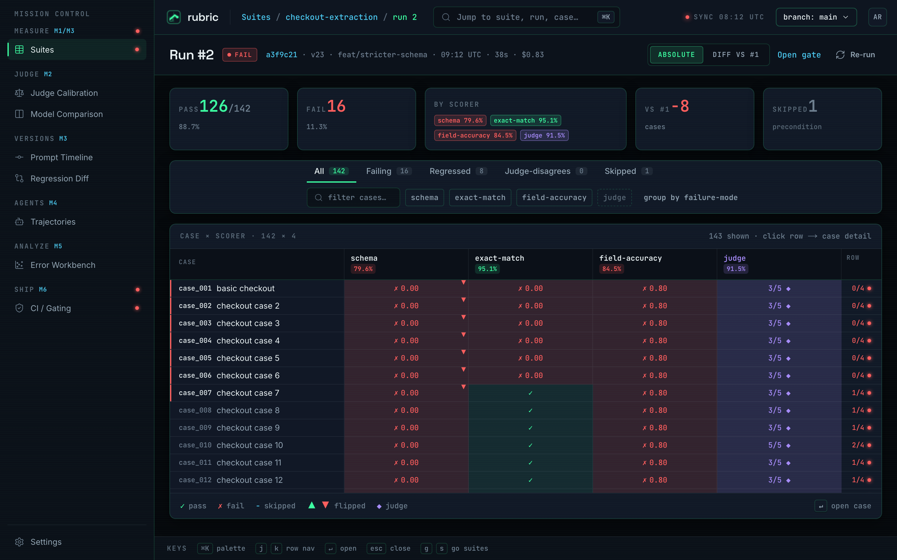
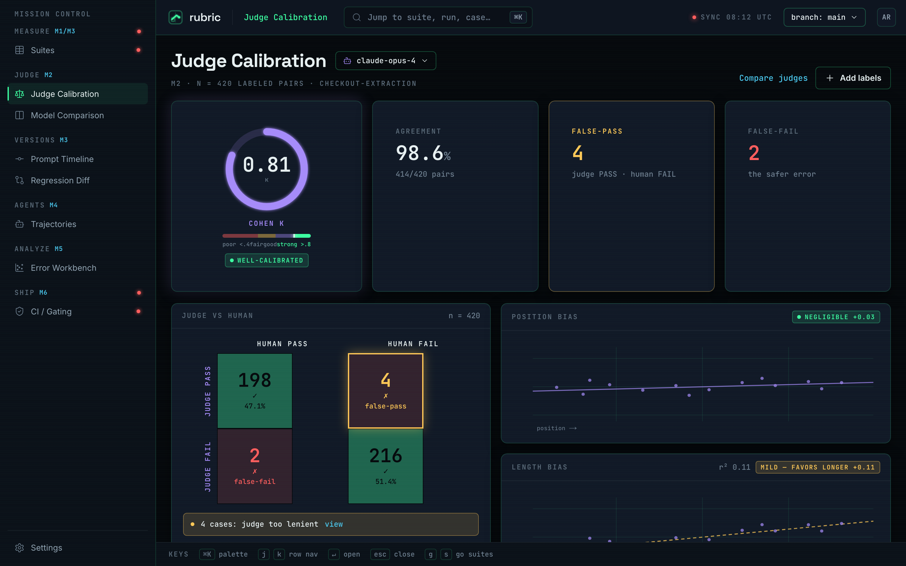
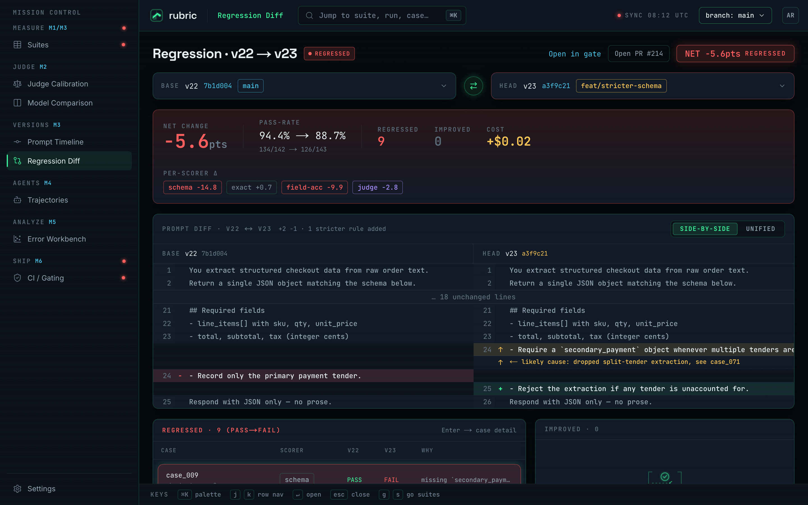
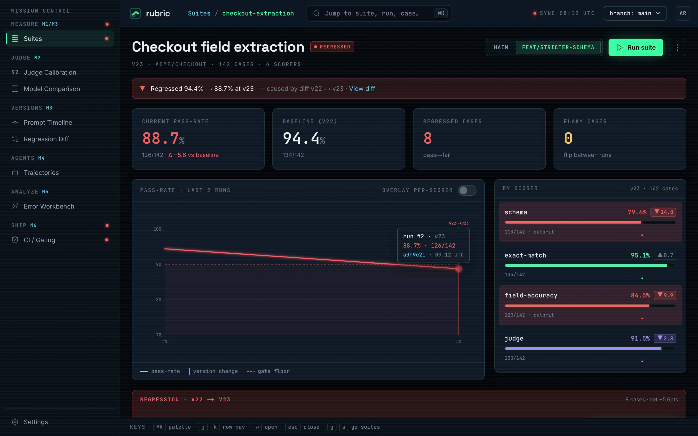
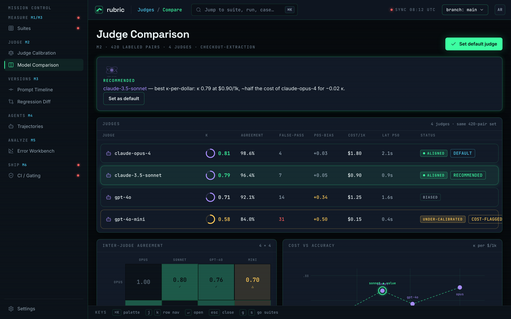
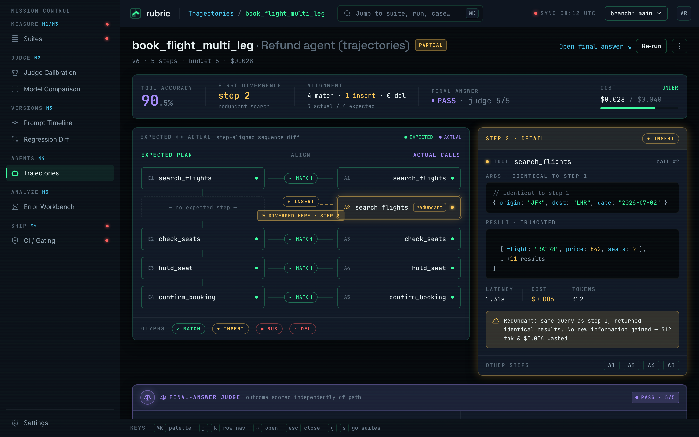
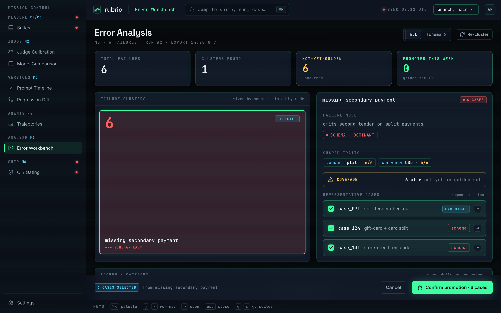
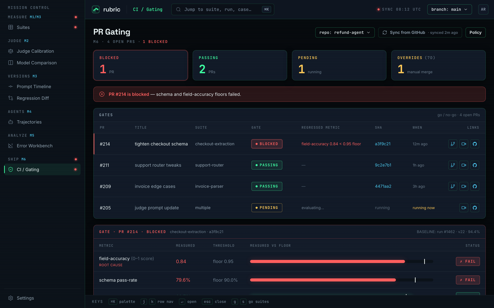
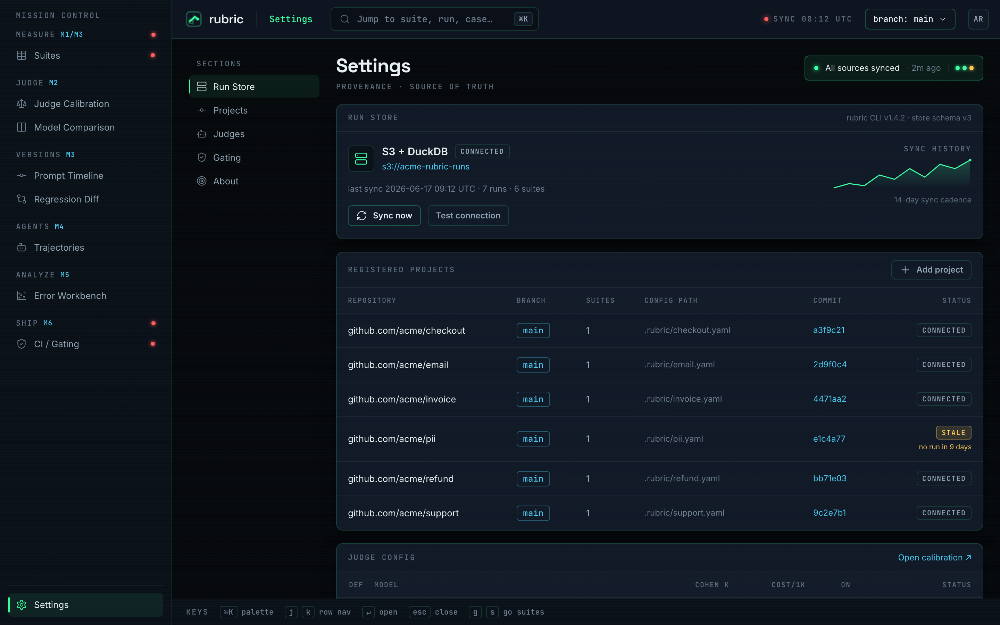

# rubric

> **CI for prompts.** Golden sets, multiple scorers, LLM-as-judge with calibration, and a quality gate that fails the PR when a prompt or agent change makes the output *worse*.

**▶ Live demo: [rubric-phi.vercel.app](https://rubric-phi.vercel.app)** &nbsp;·&nbsp; [What it does](#what-it-does) &nbsp;·&nbsp; [The CLI engine](#the-cli-engine) &nbsp;·&nbsp; [How it works](#how-it-works) &nbsp;·&nbsp; [Dashboard](#dashboard)

<p align="center">
  <a href="https://rubric-phi.vercel.app/suites">
    
  </a>
</p>

rubric treats prompts and agents like code. The same way a test suite stops you shipping a regression in *logic*, rubric stops you shipping a regression in *quality* — a reworded system prompt that quietly drops accuracy, a model swap that tanks answer faithfulness, an agent that starts picking the wrong tool. Every run is scored, persisted, and diffed against the last green run; a tracked metric dropping past its floor is a failed check, not a footnote.

It exists because an audit of two shipped products found this exact gap: prompts changed by vibes, quality measured by hope. rubric closes it — and dogfoods against those same repos.

> The whole dashboard runs on a **pre-reconciled demo dataset** seeded into the store, so every screen is explorable without an API key. The numbers are internally consistent end-to-end (one regressed suite, `126/142` passing, judge κ `0.81`, a blocked PR).

---

## What it does

- **Golden sets** — eval suites in YAML: inputs, expected outputs, and which scorers apply. Version-controlled next to the prompt they test.
- **Deterministic scorers first** — `exact-match`, `json-schema` validation, and `field-accuracy` with a pass floor. No model call, no flake, no cost. Reach for the judge only when the criterion is genuinely subjective.
- **LLM-as-judge + calibration** — rubric-driven judging for open-ended outputs, **calibrated against human labels**: Cohen's κ, a judge-vs-human confusion matrix, and position/length-bias checks — so the judge is a measured instrument, not a black box you hope agrees with you.
- **Regression gating** — every run is persisted and diffed against the baseline for the same suite + prompt version. The CLI exits non-zero when a tracked metric drops past its floor; the dashboard shows the cause-and-effect diff.
- **Agent-trajectory evals** — golden tasks with the expected tool sequence per step (tool-selection accuracy) *plus* a judge on the final answer, so you score *how* the agent got there, not just the last token.
- **GitHub Action** — wires the gate into CI: open a PR that regresses a suite and the check goes red.

---

## The CLI engine

The CLI is the product; the dashboard is a read-only lens over what it writes. It runs entirely offline for the deterministic scorers — **no API key needed** to try it.

```bash
npm install
cp .env.example .env.local      # optional: add GROQ_API_KEY for the LLM judge
npm run seed                    # create the local libSQL file + seed the demo dataset
npm run dev                     # dashboard → http://localhost:3000

# run an eval — the M1 demo scores a fixture, zero API calls, and gates on exit code:
npx tsx bin/rubric.ts run examples/settle-bill-review/suite.yaml
```

```
rubric · settle-bill-review
  case      verdict  schema  exact-match  field-accuracy
  case_071  PASS     ✓       ✓            ✓
  schema 100.0%  exact-match 100.0%  field-accuracy 100.0%
  pass-rate 100.0%   gate GREEN  floor 100.0%  exit 0
```

Command surface (`rubric` = `npx tsx bin/rubric.ts`):

```bash
rubric run <suite> [--judge] [--baseline <runId>]   # score a golden set, persist, report, gate (exit 0/1)
rubric list [--suite <slug>]                         # recent runs
rubric show <runId|caseId> [--failing]               # a run's case×scorer matrix, or one case in full
rubric diff <runA> <runB> [--flipped-only]           # pass→fail / fail→pass flips between two runs
rubric label <suite>                                 # collect human gold labels (interactive)
rubric calibrate <suite>                             # Cohen's κ + confusion matrix, judge vs. your labels
rubric trajectory <suite>                            # run agent tasks, score the tool sequence + final answer
rubric export <runId> [--format csv]                 # export results for pandas error analysis
```

### Golden-set spec

A suite is a single YAML file; cases are inline or globbed. Everything is validated with zod at load.

```yaml
version: 1
suite: checkout-extraction
title: Checkout field extraction
repo: acme/checkout
prompt: { version: v23, ref: feat/stricter-schema }
target:
  kind: exec                       # run ANY command that emits JSON on stdout (language-agnostic)
  command: "node run-prompt.mjs"   # or kind: fixture for a captured output (offline, deterministic)
scorers:
  - { type: json-schema,    name: schema,         schema: ./schemas/checkout.json }
  - { type: exact-match,    name: exact-match,    mode: by-path }
  - { type: field-accuracy, name: field-accuracy, fields: [total, currency], threshold: 0.95 }
  - { type: judge,          name: judge,          rubric: ["extracts every line item", "totals reconcile"], passScore: 4 }
cases: ./cases/*.yaml
```

---

## Dashboard

A dark mission-control lens over the run store — built from a Claude Design handoff, desktop-only by design (it's a dense instrument, not a marketing page).

### Run detail — the case × scorer matrix
Every case scored by every scorer, with the skipped case and the per-scorer pass-rates that drive the gate.



### Judge calibration — is the judge trustworthy?
Cohen's κ, the judge-vs-human confusion matrix (TP/TN/FP/FN), and position/length-bias scatters. The false-pass count is the dangerous, leniency-bias error.



### Regression diff — what changed, and what it cost
The prompt diff (cause) beside the cases that flipped pass→fail (effect).



<details>
<summary><b>More screens</b> — suite detail · model comparison · agent trajectory · error workbench · CI gating · settings</summary>

| Suite detail | Model comparison |
|---|---|
|  |  |

| Agent trajectory | Error workbench |
|---|---|
|  |  |

| CI / PR gating | Settings / connections |
|---|---|
|  |  |

</details>

---

## How it works

```
              writes                         reads
  CLI  ───────────────►  libSQL store  ◄───────────────  Next.js dashboard
 (bin/rubric.ts)         (SQLite / Turso)                 (server components)
   │                                                            
   ├─ lib/spec      golden-set YAML → zod                       
   ├─ lib/scorers   exact · json-schema · field-accuracy · judge
   ├─ lib/runner    fixture (offline) · exec (any language, JSON stdout)
   ├─ lib/judge     pluggable adapter — Groq (gpt-oss-120b) · Ollama (offline)
   └─ lib/calibration  Cohen's κ · confusion matrix · bias regression
```

The two surfaces meet only at the store: the CLI writes runs and case scores, the dashboard reads them through `server-only` queries. See [`AGENTS.md`](AGENTS.md) for the architecture and house style.

### Stack

- **Engine + CLI** — TypeScript (strict, `noUncheckedIndexedAccess`, zod at every boundary), run via `tsx`.
- **Dashboard** — Next.js 16 / React 19 App Router, dark token system, server components reading the store.
- **Store** — [libSQL](https://github.com/tursodatabase/libsql): a local file for dev/CI, hosted **[Turso](https://turso.tech)** for serverless/prod.
- **Judge** — **[Groq](https://groq.com)** `openai/gpt-oss-120b` (free tier), behind a pluggable adapter — swap in **Ollama** for fully offline judging. No proprietary-API lock-in.
- **Deploy** — Vercel + Turso. Everything in the stack is free-tier.

The local file driver means `npm install && npm run seed && npm run dev` works with **zero accounts and zero keys**. Set `TURSO_DATABASE_URL` + `TURSO_AUTH_TOKEN` to point at hosted Turso for prod.

---

## CI

The gate runs in GitHub Actions ([`.github/workflows/rubric.yml`](.github/workflows/rubric.yml)) on every PR and push to `main`: `typecheck` → `lint` → `test` → `build`, then the eval gate:

```bash
npx tsx bin/rubric.ts run examples/settle-bill-review/suite.yaml --no-store
```

The deterministic scorers need no secrets and run fully offline against a captured fixture, so the gate always runs and fails the job on a regression via the CLI's non-zero exit code. An optional **judge tier** is guarded by `if: ${{ secrets.GROQ_API_KEY != '' }}` — the deterministic gate is the hard blocker; the LLM judge is an additional signal for open-ended outputs.

### Labeling for calibration

Calibrating the judge needs **human gold labels** to measure against. `rubric label` collects them interactively from the suite's latest run — each case prints input, expected, actual, every scorer verdict, and the judge's reasoning, then prompts `[p]ass / [f]ail / [s]kip / [q]uit`:

```bash
rubric label <suite>        # label the still-unlabeled cases
rubric calibrate <suite>    # then: Cohen's κ + confusion matrix vs. your labels
```

---

## Milestones

- [x] **M1 — CLI core.** YAML golden-set spec, exact-match + JSON-schema + field-accuracy scorers, clean terminal report. Demoed against a real bill-review prompt, fully offline.
- [x] **M2 — LLM-as-judge.** Pluggable Groq/Ollama judge with strict-JSON output; calibration math (Cohen's κ, confusion matrix, position/length bias) + the `rubric label` flow to collect human labels.
- [x] **M3 — Versioning + regression tracking.** Persisted runs, prompt-version timeline, pass→fail flip diff, gate by exit code.
- [x] **M4 — Agent-trajectory evals.** Golden tasks with expected tool sequences (tool-selection accuracy) + a judge on the final answer.
- [ ] **M5 — Error-analysis workflow.** Failure clusters + CSV export shipped; parquet + the pandas clustering notebook are next.
- [x] **M6 — Dogfood + CI.** GitHub Action gating PRs; deployed to Vercel + Turso. _Pending: replace a sibling product's hardcoded confidence number with a measured rubric signal (before/after case study)._

Build order was CLI-first: M1 landed a usable evaluator before the dashboard existed. Every milestone leaves a presentable repo.

---

<p align="center"><sub>Built as an AI-native-engineering portfolio piece. Dark, fast, and free-tier all the way down.</sub></p>
